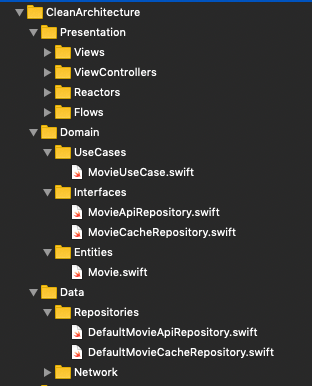
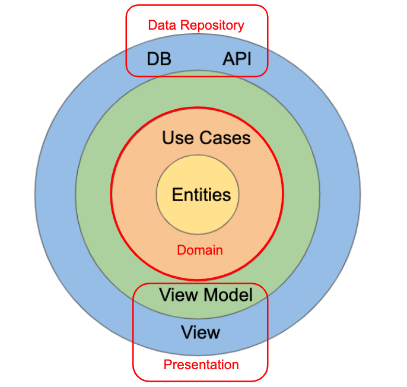

Clean Architecture
===
iOS Sample project of movies implemented with CleanArchitecture and MVVM.

[**Today I Learned Clean Architecture**] (https://github.com/sanichdaniel/today-I-learned/blob/master/swift/cleanArchitecture.md)

Architecture
---

App Divided into Domain, Presentation, Data Layer

* Domain Layer: Entity, Use Case, Repository Interface. Repository contains web api and caching

* Presentation: ViewController, View, Reactor

* Data Layer: implementation of repository

 

* Unidirectional Flow

ViewController -> Reactor -> UseCase -> Repository -> UseCase -> Reactor -> ViewController
                        
* Navigation done by *RxFlow*

DI with Factory Pattern
---
Use Factory pattern to encapsulate object creation 
* define factory methods

~~~swift
final class DIContainer {
    var networkService: CANetwork {
        return Network<WebAPI>()
    }

    // MARK: Use Cases
    func makeMovieUseCase() -> MovieUseCase {
        return DefaultMovieUseCase(movieApiRepository: makeMovieApiRepository())
    }

    // MARK: Repositories
    func makeMovieApiRepository() -> MovieApiRepository {
        return DefaultMovieApiRepository(networkService: networkService)
    }
    ...
}

~~~

* usage

~~~swift
movieDetailVC.reactor = container.makeMovieDetailViewReactor(movie: movie)
~~~

TODO
---
* add test codes to each domain, presentation, data layer
